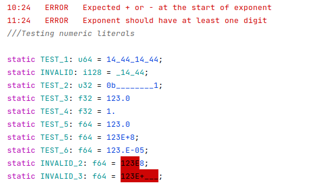
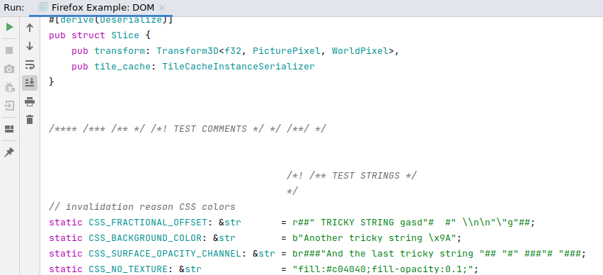
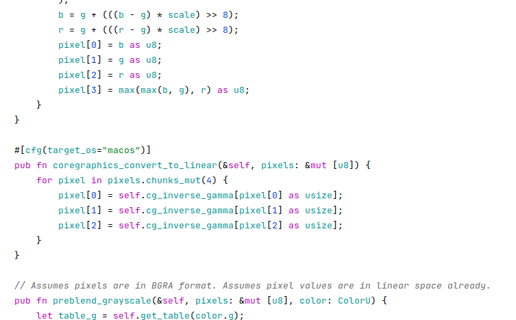

# Lexer

Implement lexer for selected programming language. Store tokens in a special table. Display structured lexical information after processing. Make sure to detect and indicate lexical errors in the input. To accomplish this a specialized error “token” could be introduced.

**Note: at least part of the tokens should be recognized using FA technique.**

Following “tokens” should be considered:
* numeric constants
* literals and symbolic constants
* preprocessor directives
* comments
* keywords
* identifiers
* operators
* punctuation marks

Options for output:
* sequence of tokens
* source code highlighting ✅ (using Jansi library)
* tokens sorted by type

## It works!

### Numbers and errors

### Strings and comments

### Firefox source code

